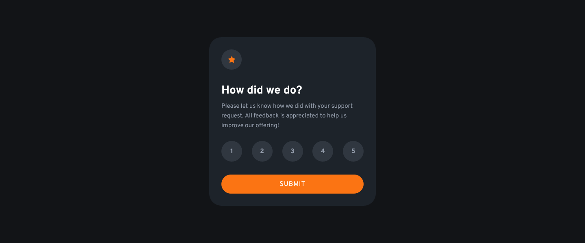
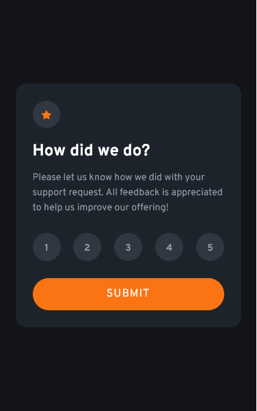
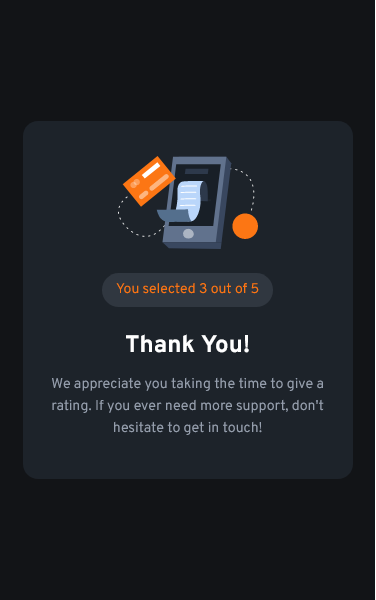

# Frontend Mentor - Intractive rating component challange
This is a solution to the [Interactive rating component](https://www.frontendmentor.io/challenges/interactive-rating-component-koxpeBUmI). The challanges at frontendmentor.io helps you improve your frontend skills by building realistic projects.

## Table of contents

 - [Overview](#overview)
   - [The challange](#the-challange)
   - [Build With](#build-with)
   - [Screenshots](#screenshots)
     - [Desktop view - Rating card](#desktop-view---rating-card)
     - [Desktop view - Thank you card](#desktop-view---thank-you-card)
     - [Mobile view - Rating card](#mobile-view---rating-card)
     - [Mobile view - Thank you card](#mobile-view---thank-you-card)
 - [Links](#links)

## Overview

### The challange
Users should be able to:
 - Select and submit a number rating
 - See the "Thank you" card state after submitting a rating
 - View the optimal layout for the app depending on their device's screen size
 - See hover states for all interactive elements on the page

### Build with
 - HTML, CSS, JavaScript
 
## Screenshots

### Desktop view - Rating card

### Desktop view - Thank you card

### Mobile view - Rating card

### Mobile view - Thank you card

## Links
 - Live Site URL: (https://md-talim.github.io/intractive-rating-component/)